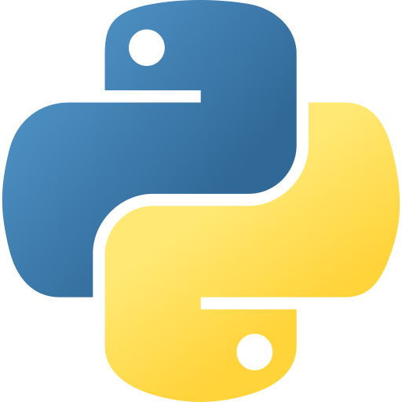

<h1 align="center">Hey! I'm Divyansh</h1>

  
   
  <a href="https://nmgdigital.com/">Forge · NMG Digital</a>

  &nbsp;&nbsp;
  &nbsp;&nbsp;
  

  
  

<h5 align="center">I don't always test my code, but when I do, I do it in production. (just a joke 🙃)</h5>

---

### About Me

- 🎓 &nbsp; CS undergrad @ **Delhi Technological University** (Class of 2027)
- 🤖 &nbsp; Building **AI Agent Orchestration** systems — multi-agent workflows, autonomous agents, and intelligent automation
- 🔭 &nbsp; Currently building cool stuff with **AI + Web**
- 🌱 &nbsp; Exploring **DSA**, **System Design** & **Full Stack Dev**
- 📬 &nbsp; Reach me at **divyanshxcode** across all platforms

---

  

  
  

---

### 🛠️ Languages & Tools

  <!-- Languages -->
  
  
  
  
  
  
  <!-- Frontend -->
  
  
  
  <!-- Backend -->
  
  
  <!-- Databases -->
  
  
  
  <!-- DevOps & Tools -->
  
  
  
  
  <!-- AI/Automation -->
  
  
  

  
  

<picture>
  <source media="(prefers-color-scheme: dark)" srcset="https://raw.githubusercontent.com/divyanshxcode/divyanshxcode/output/github-snake-dark.svg" />
  <source media="(prefers-color-scheme: light)" srcset="https://raw.githubusercontent.com/divyanshxcode/divyanshxcode/output/github-snake.svg" />
  
</picture>

---

  <i>"First, solve the problem. Then, write the code." — John Johnson</i>

